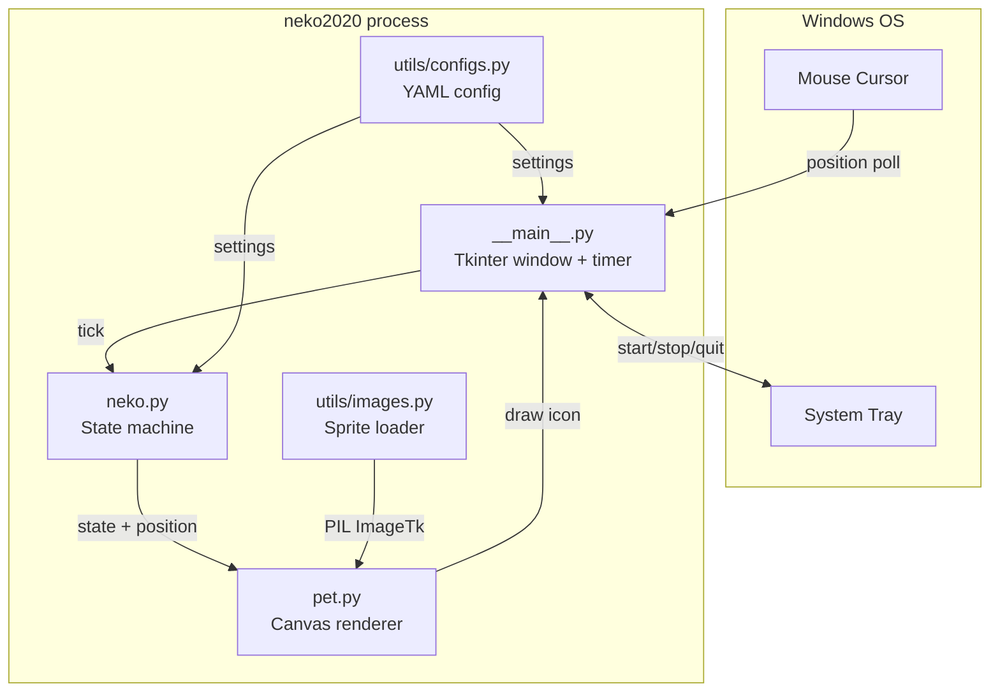
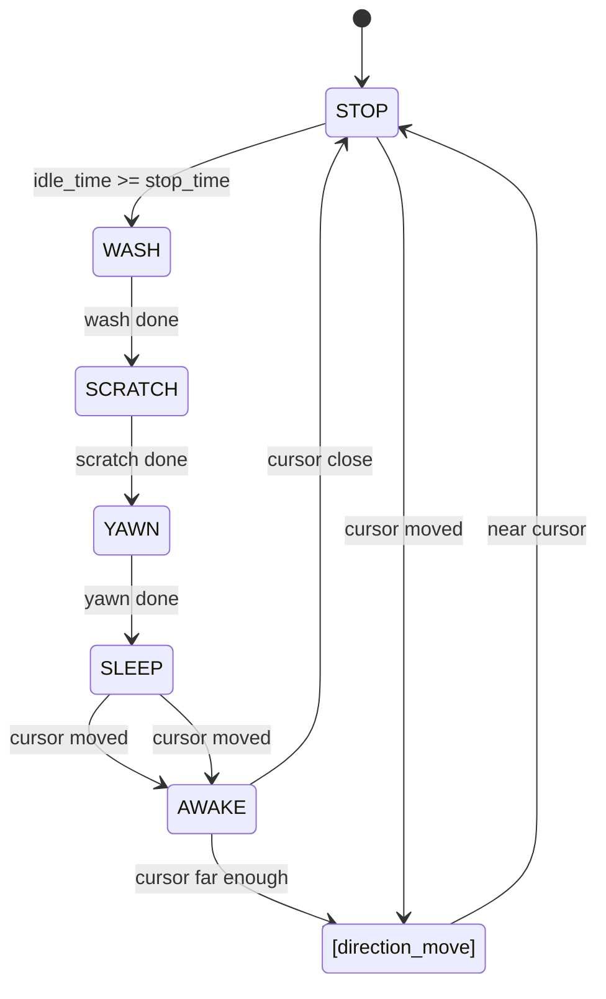

# Architecture

## High-Level Overview

neko2020 is a single-process desktop application. The main thread runs a Tkinter event loop; a background thread drives the animation timer.



## Transparent Overlay Window

The entire screen is covered by a single Tkinter window. Transparency is achieved by assigning a "transparent color" (green) to the window background and calling the Windows API to make that color invisible:

```
root.attributes('-transparentcolor', 'green')
root.attributes('-topmost', True)
root.attributes('-fullscreen', True)
```

Mouse and keyboard events pass through the window via Windows API `SetWindowLong` flags (`WS_EX_TRANSPARENT | WS_EX_LAYERED`). The window is hidden from Alt+Tab with `WS_EX_TOOLWINDOW`.

## Animation Loop

The Tkinter `after()` method drives the main animation loop at a configurable interval (default 300 ms). Each tick:

1. Query cursor position
2. Call `Neko.tick()` to update state and position
3. Call `Pet.update()` to re-draw the sprite frame on the canvas

## State Machine (neko.py)



18 states total: `STOP`, `WASH`, `SCRATCH`, `YAWN`, `SLEEP`, `AWAKE`, `*_CLAW` (×4), and 8 directional movement states.

## Design Patterns

- **State machine** — `Neko` owns all behavioral logic; `Pet` only renders
- **Observer-lite** — `__main__` owns the tick and passes data down; no event bus
- **Resource embedding** — PyInstaller bundles the entire `resource/` tree into the .exe
