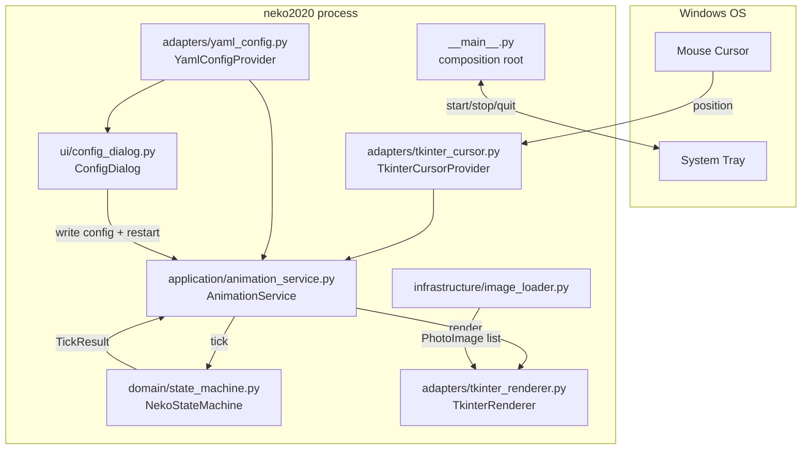
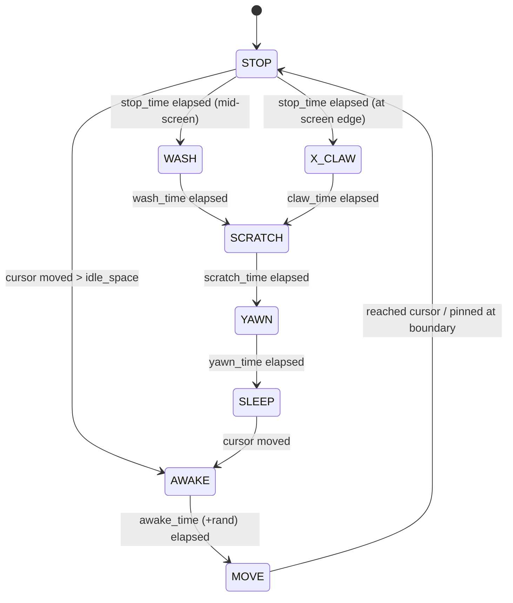

# Architecture

## High-Level Overview

neko2020 is a single-process desktop application organized in clean-architecture layers. The main thread runs the Tkinter event loop; the pystray tray icon runs detached on its own thread. Dependencies point inward: adapters/ui implement or use application ports; the domain has no I/O.



## Transparent Overlay Window

A single Tkinter window covers the entire virtual screen (bounding box of all monitors, enumerated via `EnumDisplayMonitors`). Transparency comes from a "transparent color" (green) background; the window is undecorated, topmost, and disabled so mouse events pass through:

```
root.overrideredirect(True)
root.wm_attributes("-topmost", True)
root.wm_attributes("-disabled", True)
root.wm_attributes("-transparentcolor", "green")
```

`WS_EX_TOOLWINDOW` (applied via ctypes `SetWindowLongW`) hides the window from Alt+Tab. Because Tk `geometry()` cannot express negative screen coordinates, the window is positioned with Win32 `SetWindowPos`.

## Animation Loop

`AnimationService` drives the loop with Tkinter's `after()` scheduler at `1000 // fps` ms per tick (default fps 4 → 250 ms). Each tick:

1. Query cursor position via `ICursorProvider`
2. Call `NekoStateMachine.tick(cursor, position, size, bounds)` — `bounds` is the monitor currently containing the cursor
3. Call `IRenderer.render(frame_index, x, y)` to redraw the sprite
4. Re-arm the scheduler

`start()`/`stop()`/`restart()` recreate the state machine and renderer through a session factory, so restarts pick up config changes. While stopped, an idle pump keeps the Tk loop alive.

## State Machine (domain/state_machine.py)



18 states total: `STOP`, `WASH`, `SCRATCH`, `YAWN`, `SLEEP`, `AWAKE`, `*_CLAW` (×4), and 8 directional movement states. Direction is chosen by dividing the circle into 8 sectors using `sin(pi/8)` thresholds. Movement speed is capped at `speed.max` px/tick and clamped to the monitor bounds (inset by half the sprite size).

## Design Patterns

- **Ports and adapters** — `application/ports.py` defines `IConfigProvider`, `ICursorProvider`, `IRenderer` ABCs; Tkinter/YAML specifics live in `adapters/`
- **State machine** — `NekoStateMachine` owns all behavioral logic and returns a `TickResult`; the renderer only draws
- **Session factory** — `__main__.py` supplies a factory creating fresh (state machine, renderer) pairs so restart reloads config and sprites
- **Resource embedding** — PyInstaller bundles the entire `resource/` tree into the .exe; user sprite sets in `~/.config/neko2020/resources/` are checked first
