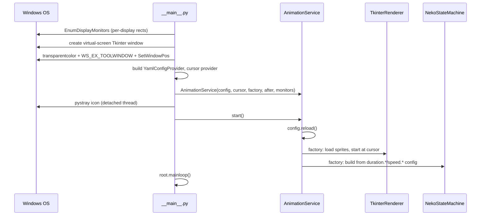
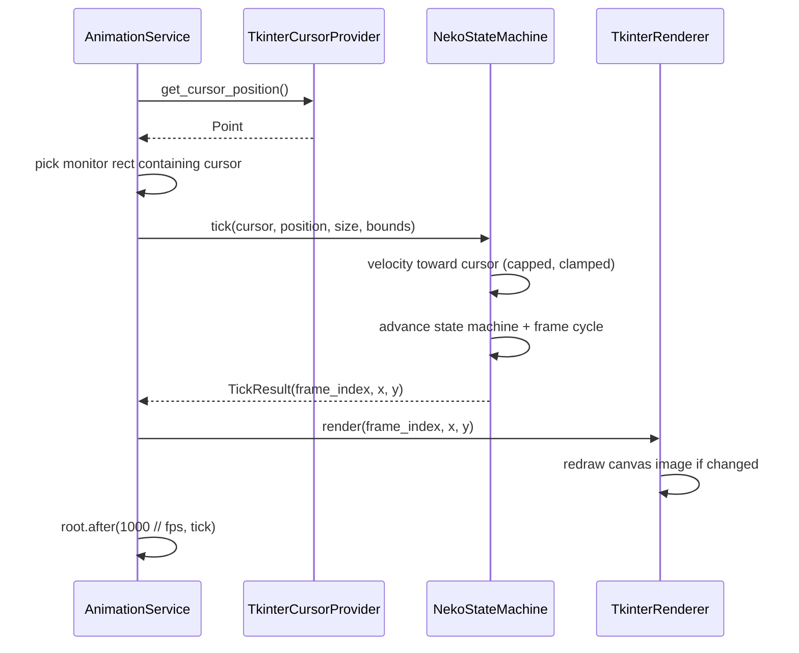

# Workflows

## Application Startup



## Animation Tick (per frame)



## State Transition (idle path)

When the cursor stops moving (within `idle_space`):

1. `STOP` — after `duration.stop`: → `WASH` mid-screen, or → `*_CLAW` if pinned at a screen edge
2. `WASH` → `SCRATCH` → `YAWN` → `SLEEP` (each after its `duration.*`)
3. `SLEEP` loops until the cursor moves
4. Cursor moves → `AWAKE` (brief, with random extra delay up to `duration.awake_rand`) → one of 8 `*_MOVE` states toward the cursor
5. Reaching the cursor (or being pinned at a boundary) → `STOP`

## Config Change (tray → dialog)

1. Tray **Config** opens `ConfigDialog` (tabbed form generated from a field list)
2. Apply validates fields, writes `~/.config/neko2020/config.yml` (previous file backed up to `.bak`)
3. `AnimationService.restart()` runs on a background thread: stops the loop, reloads config, rebuilds state machine + renderer (new animal/speed/fps take effect)

## Development Workflow

```
uv sync                          # install all deps (creates uv.lock)
uv run python -m neko2020        # run from source
uv run pre-commit install        # wire up ruff format + lint hooks
uv run pytest                    # run tests
uv run ruff format neko2020/ tests/   # format (run before every commit)
uv run ruff check neko2020/ tests/    # lint
uv run pyinstaller neko2020.spec # build dist/neko2020.exe
```

Git flow: branch from `develop`, PR back to `develop`. Bump `version` in `pyproject.toml` before anything merges to `master` (the release workflow tags from it).

## Adding a New Animal Type

1. Create `resource/<animal_name>/` (bundled) or `~/.config/neko2020/resources/<animal_name>/` (user-local)
2. Add all 32 `.ico` files named exactly as the hard-coded list in `infrastructure/image_loader.py`
3. Set `animal: <animal_name>` in the user config (or pick it in the Config dialog), or use `"random"` to include it in rotation
4. Alternatively generate a set with AI: `tools/generate_pet_gpt.py` (OpenAI) or `tools/generate_pet.py` (local Stable Diffusion) — see `tools/README.md`
