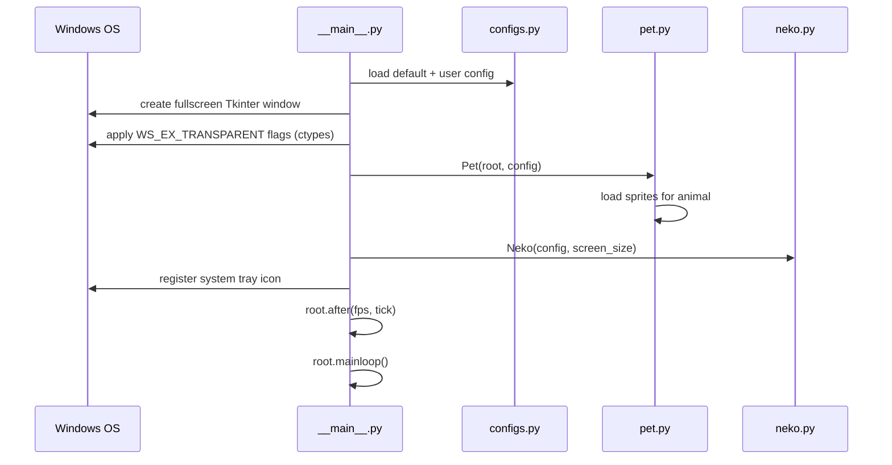
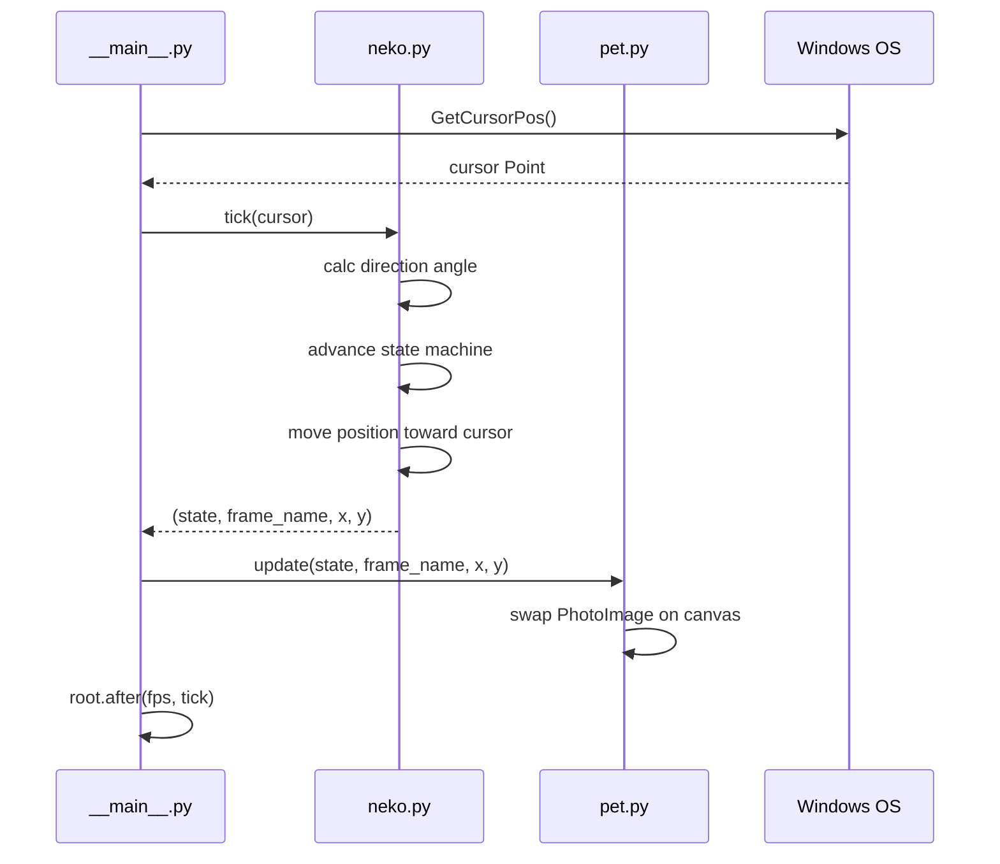
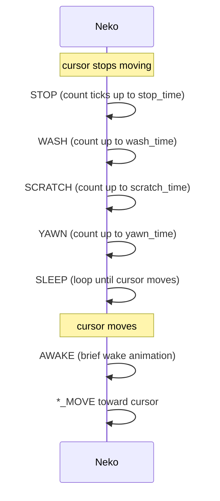

# Workflows

## Application Startup



## Animation Tick (per frame)



## State Transition (idle path)



## Development Workflow

```
poetry install          # install all deps including dev
poetry run python -m neko2020  # run from source
pre-commit install      # wire up black + flake8 hooks
poetry run pytest       # run tests
poetry run pyinstaller neko2020.spec  # build dist/neko2020.exe
```

## Adding a New Animal Type

1. Create `resource/<animal_name>/` directory
2. Add all 32 `.ico` files named exactly as the hard-coded list in `utils/images.py`
3. Set `animal: <animal_name>` in `~/.config/neko2020/config.yml`, or use `"random"` to include it in rotation
